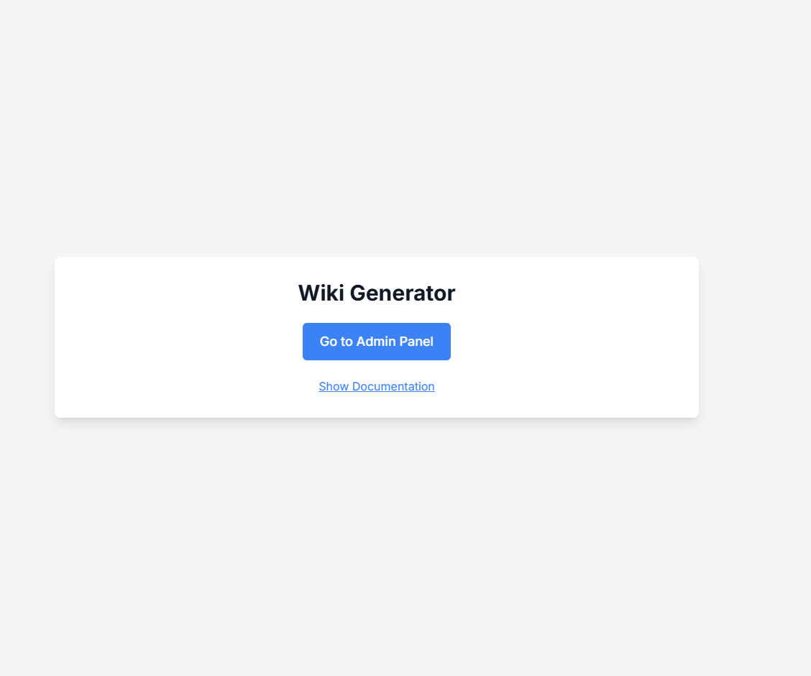
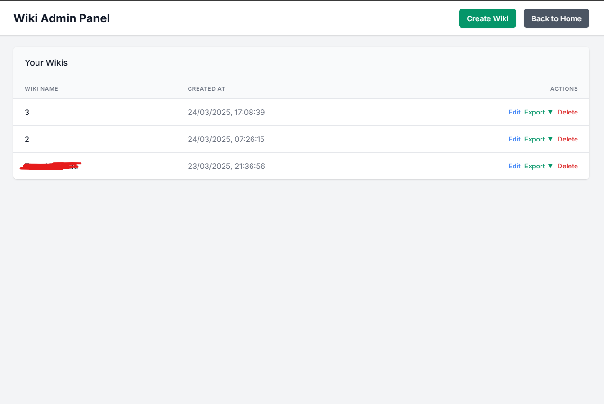
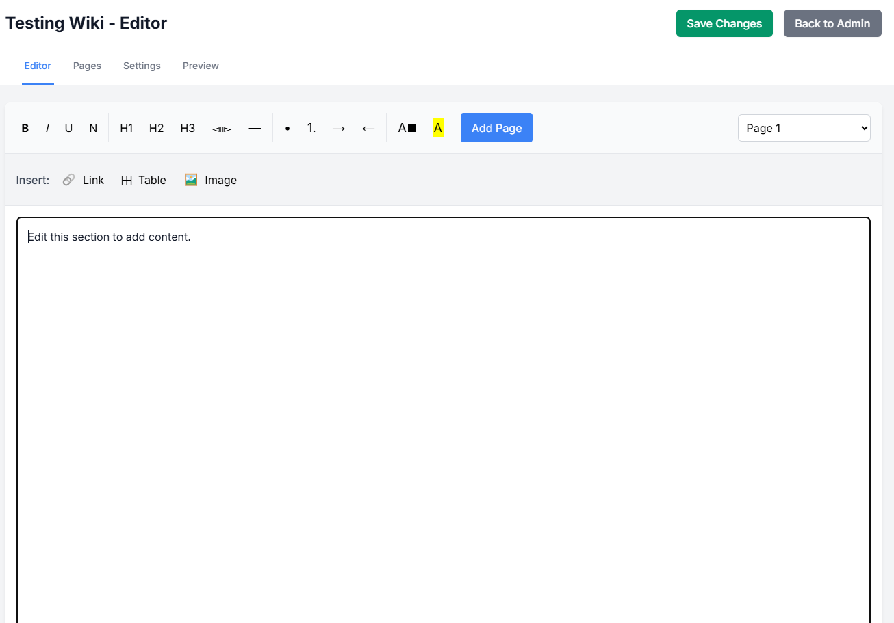
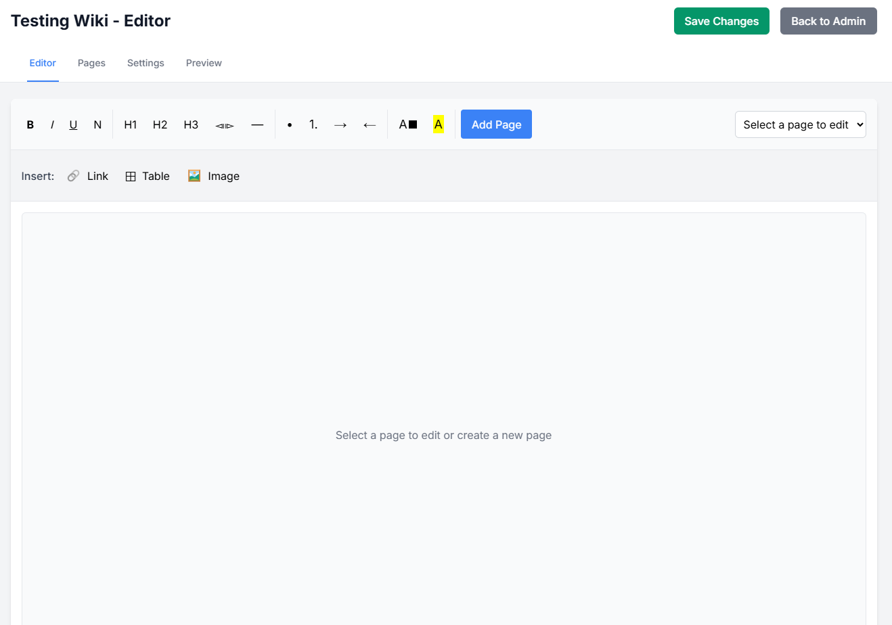

# Wiki Generator

A powerful web application for creating and managing wikis with a user-friendly interface. This project includes a Next.js frontend and Node.js backend, packaged in Docker for easy deployment.

## Features

- Create and manage wiki content
- Custom rich text editor for easy content creation
- File and image upload capabilities
- Responsive design for desktop and mobile
- Docker-ready for simple deployment

## Screenshots

<table>
  <tr>
    <td></td>
    <td></td>
  </tr>
  <tr>
    <td></td>
    <td></td>
  </tr>
</table>

## Custom Editor Guide

The application includes a custom-built rich text editor with the following features:

### Adding Links
1. Click the link icon in the toolbar
2. Add the URL or choose an internal page
3. Highlight the text in the text area you want to convert to a link
4. Click "Insert"

### Adding Images
1. Select the image from your computer
2. Set the dimensions (note: for 500px width, use 5000 in the input)
3. Place the cursor where you want the image to appear
4. Click "Insert"

### Adding Tables
1. Place the cursor where you want the table to appear
2. Click the table icon and set up your table structure
3. Click "Insert"
4. The table can be edited after insertion

## Installation

### Using Docker (Recommended)

The easiest way to run Wiki Generator is using Docker and Docker Compose.

1. Clone the repository:
```
git clone https://github.com/yourusername/wiki-generator.git
cd wiki-generator
```

2. Start the Docker containers:
```
docker-compose up -d
```

3. Access the application:
   - Frontend: http://localhost:3030
   - Backend API: http://localhost:3031

### Manual Installation

If you prefer to run the application without Docker:

1. Clone the repository:
```
git clone https://github.com/yourusername/wiki-generator.git
cd wiki-generator
```

2. Install backend dependencies:
```
cd app/backend
npm install
npm run build
```

3. Install frontend dependencies:
```
cd ../frontend
npm install
```

4. Start the backend:
```
cd ../backend
npm start
```

5. Start the frontend in a separate terminal:
```
cd ../frontend
npm run dev
```

6. Access the application:
   - Frontend: http://localhost:3000
   - Backend API: http://localhost:3001

## Environment Variables

The following environment variables can be configured:

- `NODE_ENV`: Set to `production` for production mode
- [Add other environment variables as needed]

## Project Structure

```
wiki-generator/
├── app/
│   ├── backend/       # Node.js backend API
│   ├── frontend/      # Next.js frontend application
│   └── docs/
│       └── images/    # Screenshots and documentation images
├── created_wikis/     # Directory where generated wikis are stored
├── Dockerfile         # Docker image definition
├── docker-compose.yml # Docker Compose configuration
└── docker-start.sh    # Startup script for Docker
```

## Development

To contribute to the development of Wiki Generator:

1. Fork the repository
2. Create a feature branch: `git checkout -b feature-name`
3. Make your changes
4. Submit a pull request

## License

MIT License

Copyright (c) 2023 [Dr M. As'ad]

Permission is hereby granted, free of charge, to any person obtaining a copy
of this software and associated documentation files (the "Software"), to deal
in the Software without restriction, including without limitation the rights
to use, copy, modify, merge, publish, distribute, sublicense, and/or sell
copies of the Software, and to permit persons to whom the Software is
furnished to do so, subject to the following conditions:

The above copyright notice and this permission notice shall be included in all
copies or substantial portions of the Software.